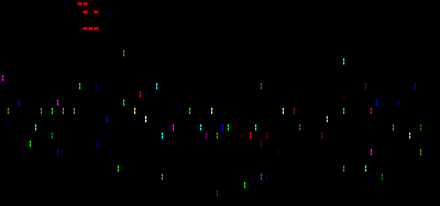

# Fireworks
ASCII Fireworks in C#

## How does it work?

There are two main components: the `IEntity` and the `IEntityManager`

### IEntity

The `IEntity` is any kind of figure that wants to be drawn. In this case, there are two entities: the `Firework` and the `Sparkles`.

When a `Firework` dies, it's deathwish is to spawn a `Sparkles` in it's place, and when the `Sparkles` die, it's deathwish is to spawn a new `Firework`.

The `IEntity` has two functions: a `Draw`, an `Update`, and a `RequestDeathWish`.

The `Update` function is where all core logic and processing goes - this could be parallelized as to speed up the process in the event that lots of entities are being processed. This returns an `UpdateResult`, which will tell the `IEntityManager` whether to:
 - Standby: Ignore the entity
 - Draw: Schedule the entity for drawing on the next loop
 - Kill: Kill the entity immedietly after processing

Standby: Nothing happens.

Draw: The `Draw` function is where the entity draws itself to the screen. No logic should be performed here, as all the logic should already be calculated in the `Update` function. When the entity requests to be drawn, this function will be called.

Kill: The entity's `RequestDeathWish` function will be called to store the deathwish, and then promptly disposed. The deathwish will be executed in parallel while drawing.

### IEntityManager

The `IEntityManager` handles each entity. It runs in a loop. First, it'll call Update on every entity, asking them for their state. 
 - Kill: Their death wish and they will be promptly disposed
 - Draw: They will be drawn
 - Standby: Ignored

Immedietly after calling update, every entity that requests a `Kill` will have their death wish stored and be disposed. Then, the entities that wish to be drawn will be drawn in parallel to executing the deathwishes gathered from the disposed entities.